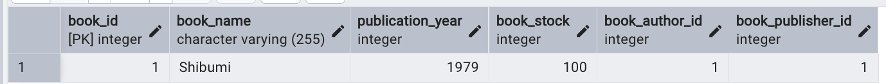
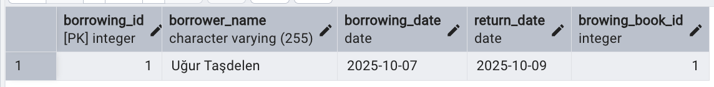
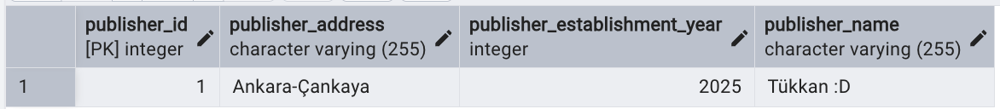
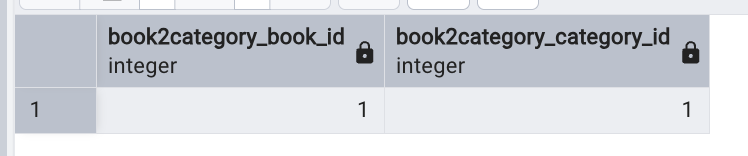

### A Library Management System using JPA

##### Author Table :

  

##### Book Table :

  

##### Borrowing Table :

  

##### Category Table :

  

##### Publisher Table :

  

##### Book-Category Associative Table :

  

